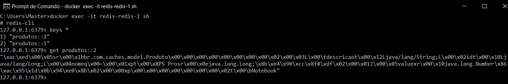

# Spring Cache com Redis

API para demonstração de uso do Cache com Redis
<br/>

## Redis
Objeto Produto serializado no banco redis




## Tecnologias
- **Java 17** 
- **Spring Boot** 
- **Lombok**
- **Spring Cache**
- **Redis**
- **Docker**


## Como rodar a aplicação

**Inicie a aplicação usando qualquer um dos comandos abaixo**

> **Nota:** Para os dois primeiros comandos, é necessario executar dentro da pasta raiz do projeto i.e **spring-cache** pasta

- **Usando maven** ``` mvn spring-boot:run```

- **A partir de arquivo jar**
  Criar um arquivo jar usando o comando '**mvn clean install**' e então executar 
  <br/>```java -jar target/spring-cache-0.0.1-SNAPSHOT.jar```


- **Diretamente a partir de uma IDE**
  <br/>```Clicar com o botão direito em SpringCacheApplication.java e então clicar na opção 'Run' ```
  <br/><br/>

> **Nota:** Por padrão aplicações Spring Boot iniciam na porta 8080. 
Se a porta 8080 estiver ocupada em seu sistema, então voce pode mudar o numero da porta atualizando a linha **server.port**  dentro do arquivo 
**application.properties** que esta disponivel dentro da pasta **src > main > resources**.

